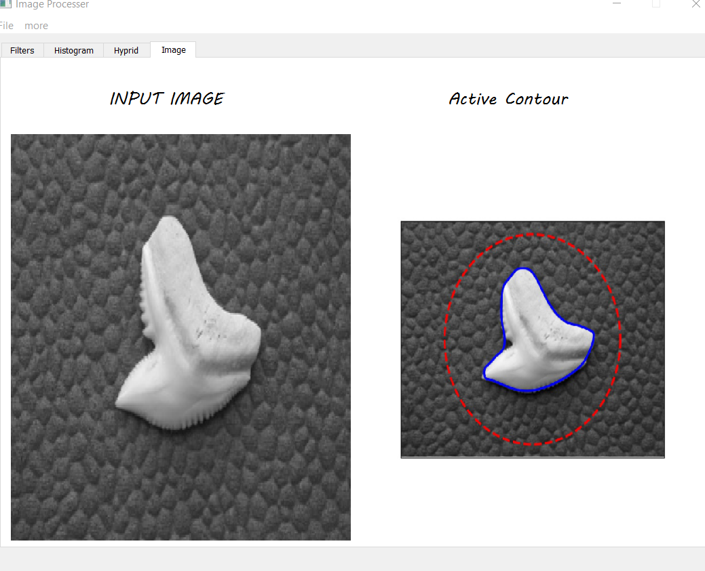
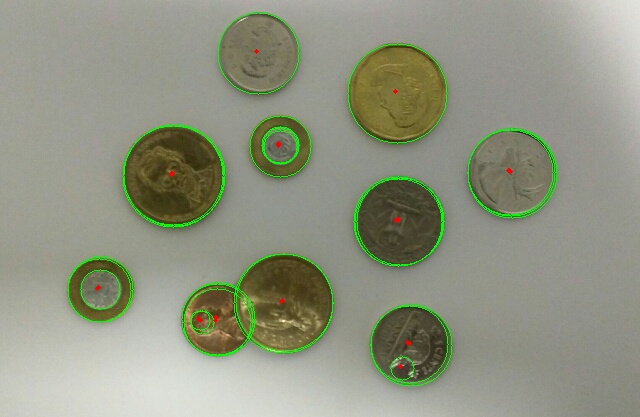
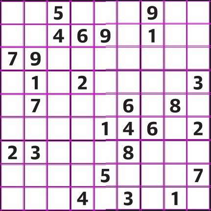

| Submitted to | Prof/ Ahmed M. Badawi |  |  |
| ----------- | ----------- | ----------- | ----------- |
| **By** | - Adel Moustafa | Sec: 2 | Bn: 3 |
|     | - Omar Ibrahim | Sec: 2 | Bn: 9 |
|     | - Mohamed Yasser | Sec: 2 | Bn: 24 |
| | - Mahmoud Abdelrhman | Sec: 2 | Bn: 25 |
| **Group ID** | 19 |  |  |

------

[TOC]

------

# Overview of the task

This project consists of 3 modules:  
1-**main.py**  : main program  
2-**GUI.py** : Pyqt GUI script  
3-**func.py** : contains the implementation of the used functions  
3-**Active_Contour.py** : contains the implementation of Active Contour Algorithm
3-**fn.py** : contains the implementation of Circle & line detection Algorithm

	
------

# Program description

- **From** more, you can **choose** any option you like and a pop-up window will be shown to choose an image and the specified option will be applied.

------

# Results

- Active Contour 

  

- Circle Detection
  

- Line Detection

  

  

